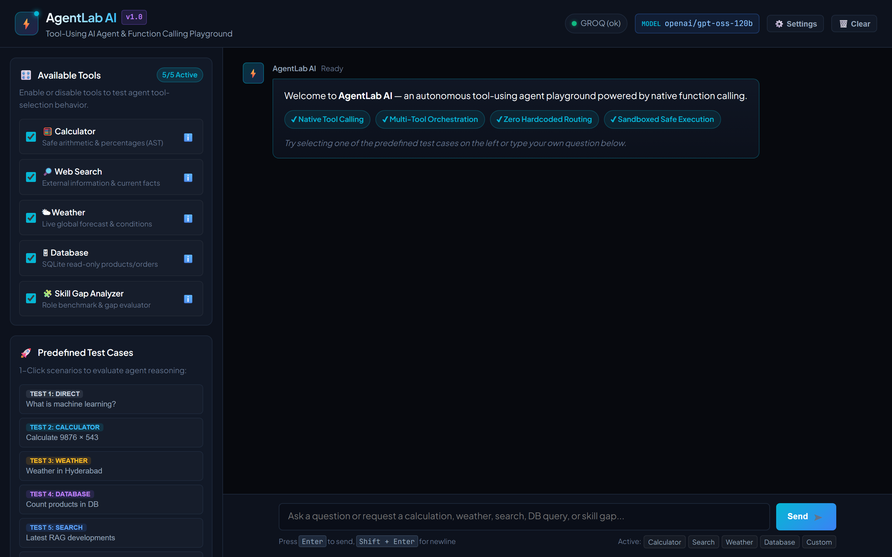
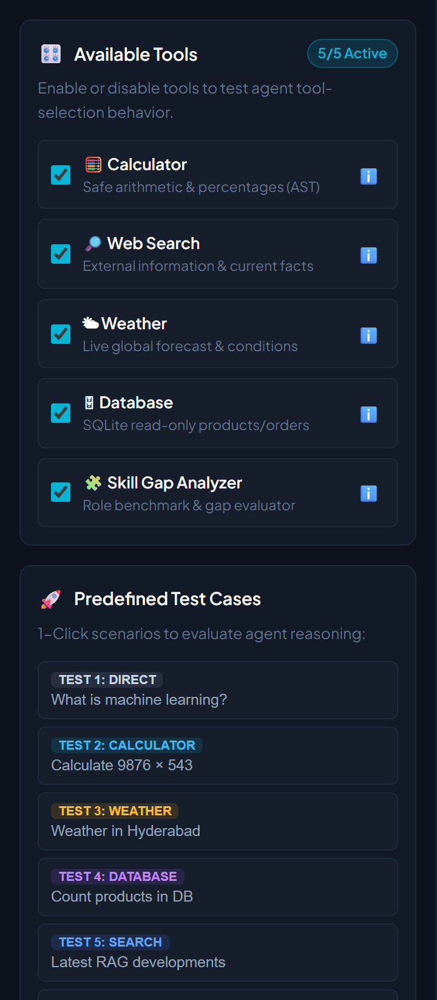
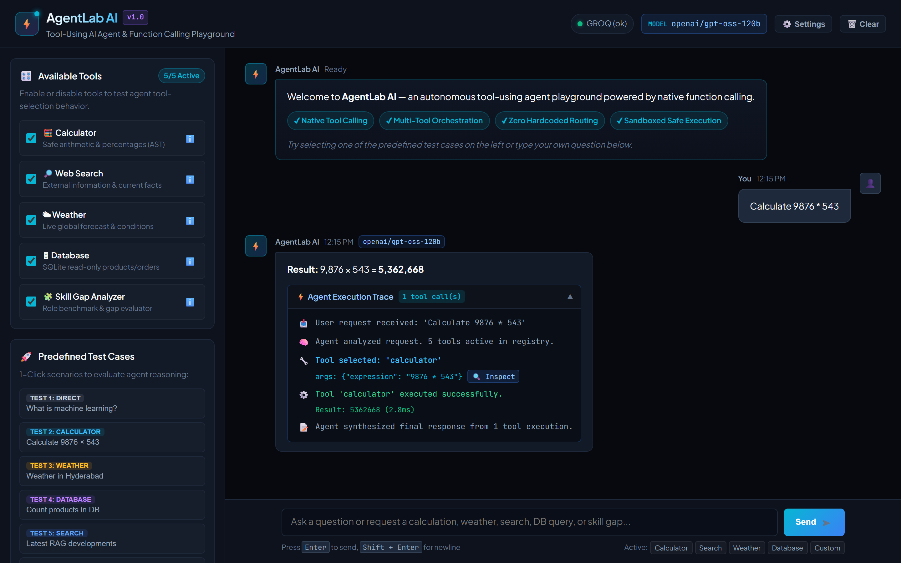
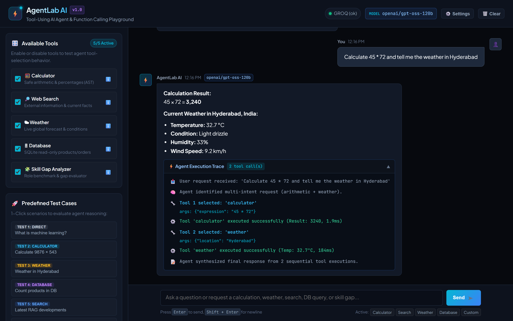
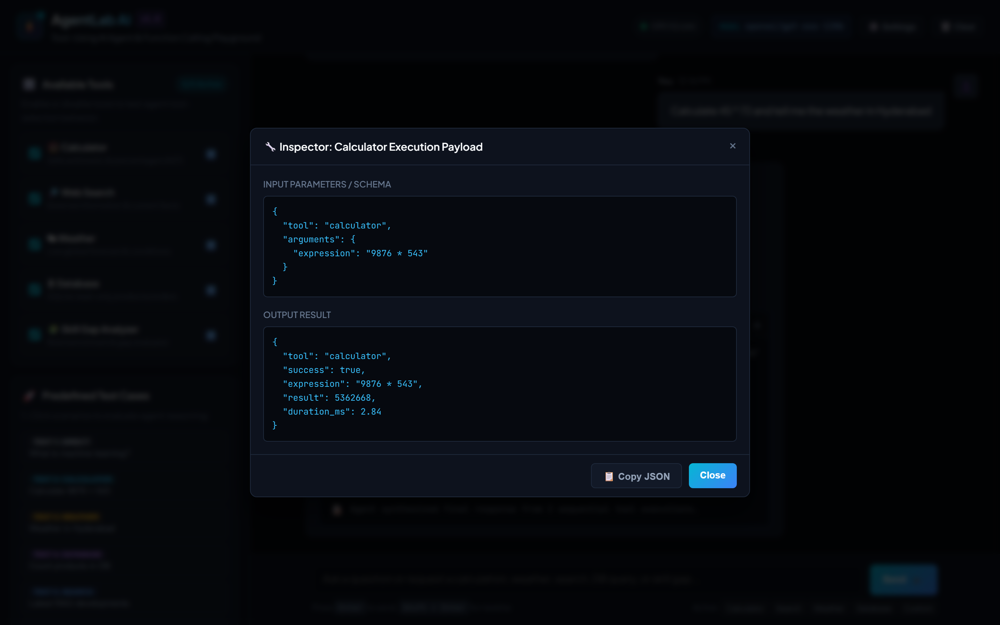
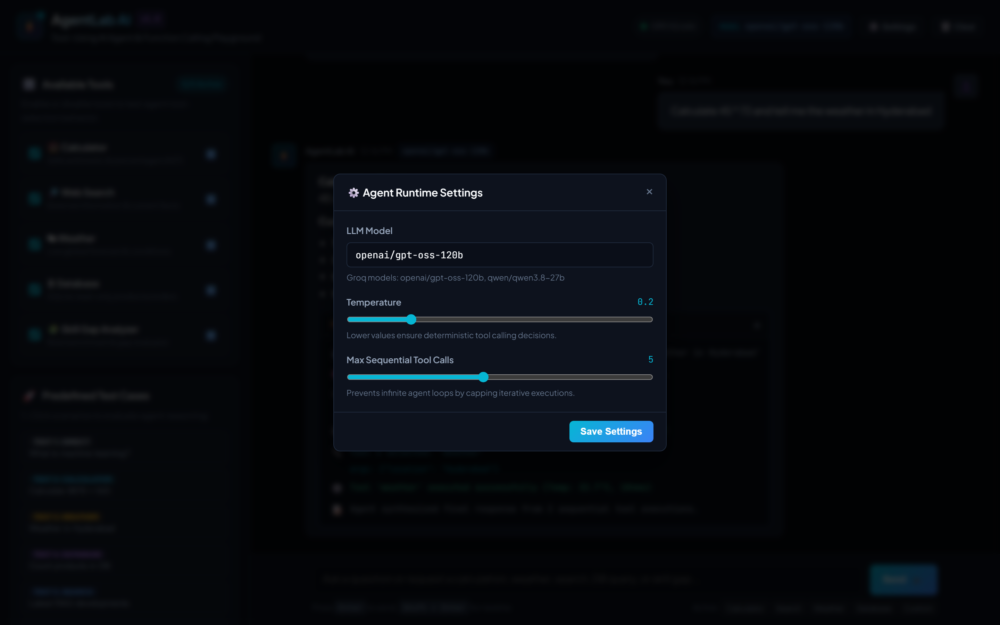
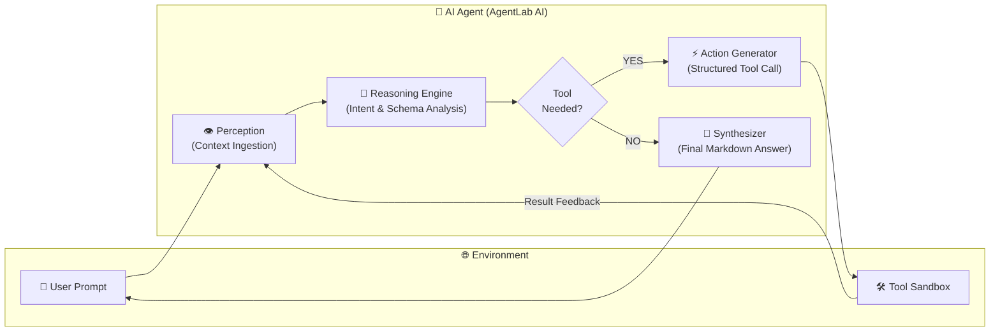
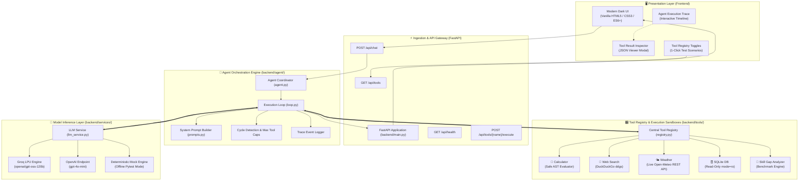
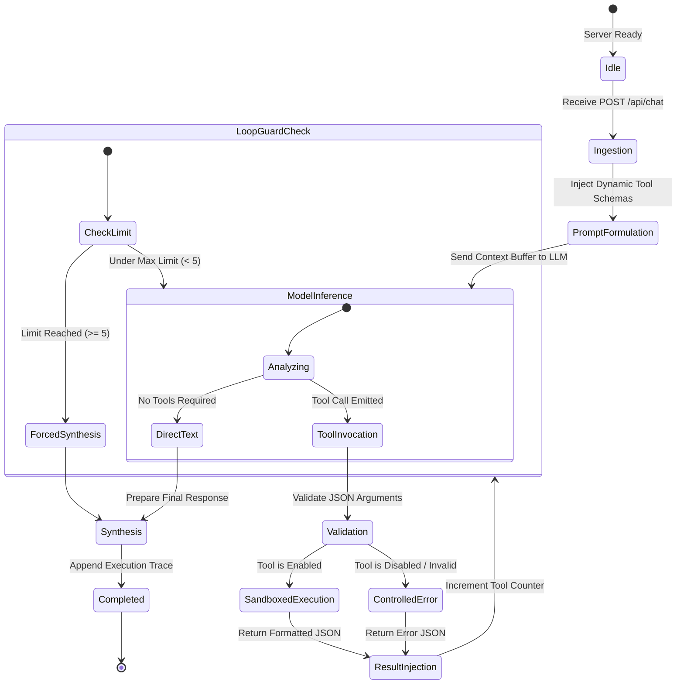

<div align="center">

<!-- Header Banner -->


<br/>

# ⚡ AgentLab AI
### *Autonomous Tool-Using AI Agent · Native Function Calling · Multi-Tool Orchestration*

<br/>

<!-- Tech Stack Badges -->
[](https://python.org)
[](https://fastapi.tiangolo.com)
[](https://groq.com)
[](https://openai.com)

<br/>

[](https://sqlite.org)
[](https://docs.pydantic.dev)
[](https://www.uvicorn.org)
[](https://pytest.org)

<br/>

<!-- Status & Operational Badges -->
[]()
[]()
[]()
[]()
[]()
[](https://github.com/sunbyte16)

<br/>

---

> ⚡ **AgentLab AI** is an enterprise-grade AI Agent MVP engineered for **Day 3 of the Applied AI Agents Internship**.
> Powered by native function calling on models such as `openai/gpt-oss-120b`, AgentLab AI autonomously understands user objectives, determines when tools are needed, validates JSON parameters, executes sandboxed functions in parallel/sequence, and synthesizes grounded final responses.
> **No hardcoded keyword matching. Zero fabricated data. Complete execution observability.**

---

</div>

<br/>

## 📸 Visual Showcase & Dashboard Tour

<div align="center">

| 🖥️ Complete Playground Overview | 🎛️ Tools Dashboard & Predefined Test Cases |
|:---:|:---:|
| [](images/01_dashboard_overview.png) | [](images/02_tools_dashboard_sidebar.png) |
| *Full developer interface with dark UI & status pills* | *Real-time tool toggles, schemas & 1-click test suite* |

<br/>

| ⚡ Step-by-Step Agent Execution Trace | 🔄 Multi-Tool Sequential Orchestration |
|:---:|:---:|
| [](images/03_agent_execution_trace.png) | [](images/04_multi_tool_orchestration.png) |
| *Real-time reasoning timeline with millisecond latency* | *Calculator + Weather executed sequentially in one turn* |

<br/>

| 🔍 Tool Result Inspector Modal (JSON) | ⚙️ Agent Runtime Settings Drawer |
|:---:|:---:|
| [](images/05_tool_result_inspector_modal.png) | [](images/06_runtime_settings_drawer.png) |
| *1-Click JSON inspection & clipboard copy support* | *Live model selection, temperature & max call caps* |

</div>

<br/>

---

## 📑 Table of Contents

1. [🌟 Overview](#-overview)
2. [🤖 What is an AI Agent?](#-what-is-an-ai-agent)
3. [🔧 What is Tool Calling?](#-what-is-tool-calling)
4. [🏛️ Modern Architecture & Component Diagrams](#-modern-architecture--component-diagrams)
5. [🧰 Available Tools & Capabilities](#-available-tools--capabilities)
6. [📋 Formal Tool Schemas](#-formal-tool-schemas)
7. [🔁 The Agent Reasoning Loop](#-the-agent-reasoning-loop)
8. [🧠 Tool Selection vs Direct Response](#-tool-selection-vs-direct-response)
9. [🛡️ Defensive Engineering & Loop Safeguards](#-defensive-engineering--loop-safeguards)
10. [🔒 Security Architecture](#-security-architecture)
11. [💻 Tech Stack](#-tech-stack)
12. [📂 Project Structure](#-project-structure)
13. [🚀 Installation & Setup](#-installation--setup)
14. [⚙️ Environment Variables](#-environment-variables)
15. [▶️ Running the Application](#-running-the-application)
16. [🧪 Test Matrix & Automated Verification](#-test-matrix--automated-verification)
17. [🎯 Live Demonstration Script (5-8 Minutes)](#-live-demonstration-script-5-8-minutes)
18. [⚠️ Known Limitations](#-known-limitations)
19. [🔮 Future Roadmap](#-future-roadmap)
20. [🎓 Learning Outcomes](#-learning-outcomes)
21. [🌐 Connect & Author](#-connect--author)

---

## 🌟 Overview

Standard LLM chatbots operate within static knowledge boundaries. When asked to multiply large numbers, query inventory databases, or fetch current weather, pure language models frequently **hallucinate** inaccurate numbers and dates.

**AgentLab AI** resolves this fundamental limitation by implementing an **autonomous agent controller loop**:
- The model treats external capabilities as callable functions described by formal JSON schemas.
- It dynamically generates machine-readable arguments instead of guessing answers.
- The Python backend securely executes the requested code inside sandboxed modules.
- The execution feedback is fed back into the context buffer for progressive multi-step reasoning.

```
User Prompt ──> Intent Analysis ──> Tool Selection ──> Sandboxed Execution ──> Feedback Synthesis ──> Final Answer
```

---

## 🤖 What is an AI Agent?

An **AI Agent** is an autonomous entity that perceives its environment, makes informed decisions based on an objective, takes actions through tool calling, and monitors the consequences of those actions to adjust its trajectory.



---

## 🔧 What is Tool Calling?

**Tool Calling** (Function Calling) allows LLMs to interact reliably with the external world:
1. **Schema Declaration**: The application informs the model of available functions via structured JSON definitions (name, description, input properties, required fields).
2. **Intent & Parameter Generation**: When a prompt requires calculations or lookups, the model generates a structured JSON object rather than answering directly.
3. **Deterministic Execution**: The backend runs standard Python functions (AST evaluation, SQLite queries, REST API requests).
4. **Context Injection**: The tool's output is returned to the model with role `tool`, enabling the model to synthesize verified facts.

---

## 🏛️ Modern Architecture & Component Diagrams

AgentLab AI is engineered using a clean, decoupled modular architecture separating API ingestion, stateful orchestration, tool sandboxing, and provider-agnostic LLM integration.

### End-to-End System Architecture



---

### Sequence Diagram: The Cyclical Function Calling Loop

```mermaid
sequenceDiagram
    autonumber
    actor User as 👤 User Client
    participant API as ⚡ FastAPI (/api/chat)
    participant Loop as 🔁 Agent Loop
    participant LLM as 🧠 LLM (Groq / OpenAI)
    participant Reg as 🎛️ Tool Registry
    participant Tool as 🛠️ Sandboxed Tool

    User->>API: POST /api/chat {message, enabled_tools}
    API->>Loop: run(user_message, active_tools)
    Loop->>Loop: Record trace: 'start' & 'thought'
    Loop->>LLM: call_llm(messages, active_tool_schemas)

    alt Scenario A: Tool Call Required (e.g. 48392 * 274)
        LLM-->>Loop: tool_calls: [{name: "calculator", args: {expression: "..."}}]
        Loop->>Loop: Record trace: 'tool_call'
        Loop->>Reg: execute("calculator", args)
        Reg->>Tool: evaluate_expression() [AST Sandbox]
        Tool-->>Reg: {success: true, result: 13259408}
        Reg-->>Loop: Tool Execution Payload (duration: 2.8ms)
        Loop->>Loop: Record trace: 'tool_result'
        Loop->>Loop: Append {role: "tool", content: json} to messages
        Loop->>LLM: call_llm(updated_messages_with_tool_result)
        LLM-->>Loop: content: "48392 * 274 equals 13,259,408." (tool_calls: [])
        Loop->>Loop: Record trace: 'final_answer'
        Loop-->>API: ChatResponse {answer, trace, tool_calls_executed: 1}
        API-->>User: Render Answer + Interactive Trace Card
    else Scenario B: Direct Answer (e.g. "What is Machine Learning?")
        LLM-->>Loop: content: "Machine learning is..." (tool_calls: [])
        Loop->>Loop: Record trace: 'direct_response'
        Loop-->>API: ChatResponse {answer, trace, tool_calls_executed: 0}
        API-->>User: Render Direct Answer (0 Tools Used)
    end
```

---

### State Machine Transition Diagram



---

## 🧰 Available Tools & Capabilities

AgentLab AI comes pre-configured with 5 distinct sandboxed tools:

```
┌────────────────────────────────────────────────────────────────────────┐
│                        AGENTLAB AI TOOL SUITE                          │
├──────────────────┬─────────────────┬──────────────────┬────────────────┤
│ 🧮 Calculator    │ 🔎 Search       │ 🌤 Weather        │ 🗄 Database    │
│ Safe AST Math    │ DuckDuckGo ddgs │ Open-Meteo Live  │ SQLite mode=ro │
├──────────────────┴─────────────────┴──────────────────┴────────────────┤
│ 🧩 Skill Gap Analyzer — Custom Role Readiness & Competency Benchmarking│
└────────────────────────────────────────────────────────────────────────┘
```

| Tool | Name | Module | Input Schema | Safety & Sandbox Guarantees |
| :--- | :--- | :--- | :--- | :--- |
| 🧮 | **Calculator** | [`calculator.py`](file:///c:/Users/sharm/OneDrive/Desktop/Training%20Program/Applied%20AI%20Agents/Day%203%20Agents%20&%20Tool%20Calling/backend/tools/calculator.py) | `{"expression": "48392 * 274"}` | **Safe AST Parser**: strictly allows binary operators (`+`, `-`, `*`, `/`, `//`, `%`, `**`), powers, percentages. Rejects all `eval()`, code execution, calls, and attributes. |
| 🔎 | **Web Search** | [`search.py`](file:///c:/Users/sharm/OneDrive/Desktop/Training%20Program/Applied%20AI%20Agents/Day%203%20Agents%20&%20Tool%20Calling/backend/tools/search.py) | `{"query": "latest RAG AI", "max_results": 3}` | **Live DuckDuckGo**: Real web results via `ddgs`. Untrusted external data isolation prevents prompt injection overrides. |
| 🌤 | **Weather** | [`weather.py`](file:///c:/Users/sharm/OneDrive/Desktop/Training%20Program/Applied%20AI%20Agents/Day%203%20Agents%20&%20Tool%20Calling/backend/tools/weather.py) | `{"location": "Hyderabad"}` | **Live Open-Meteo REST API**: Geocoding + live meteorological forecasts (temp, humidity, wind, condition). Zero fake data. |
| 🗄 | **Database** | [`database.py`](file:///c:/Users/sharm/OneDrive/Desktop/Training%20Program/Applied%20AI%20Agents/Day%203%20Agents%20&%20Tool%20Calling/backend/tools/database.py) | `{"operation": "count_products"}` or `{"query": "SELECT..."}` | **Physical `mode=ro` SQLite URI**: Hardware-enforced read-only safety. Regex and token blocking prevents `DROP`, `DELETE`, `UPDATE`, `INSERT`, `ALTER`. |
| 🧩 | **Skill Gap Analyzer** | [`custom_tool.py`](file:///c:/Users/sharm/OneDrive/Desktop/Training%20Program/Applied%20AI%20Agents/Day%203%20Agents%20&%20Tool%20Calling/backend/tools/custom_tool.py) | `{"target_role": "MLE", "skills": [...]}` | **Deterministic Role Taxonomy**: Compares candidate capabilities against curated industry benchmarks, calculating match percentage and priority learning roadmaps. |

---

## 📋 Formal Tool Schemas

Every tool conforms to OpenAI's function calling JSON schema specification:

### 1. Calculator Tool Schema
```json
{
  "type": "function",
  "function": {
    "name": "calculator",
    "description": "Perform exact mathematical calculations and arithmetic operations (addition, subtraction, multiplication, division, powers, percentages, and complex expressions).",
    "parameters": {
      "type": "object",
      "properties": {
        "expression": {
          "type": "string",
          "description": "Mathematical expression to calculate, e.g., '48392 * 274', '15% of 84750', '(1250 / 5) + 73'."
        }
      },
      "required": ["expression"]
    }
  }
}
```

### 2. Database Tool Schema
```json
{
  "type": "function",
  "function": {
    "name": "database",
    "description": "Query the internal SQLite database containing application data tables: 'products', 'customers', and 'orders'. Supports structured operations or read-only SELECT queries.",
    "parameters": {
      "type": "object",
      "properties": {
        "operation": {
          "type": "string",
          "enum": [
            "count_products",
            "products_above_price",
            "total_order_value",
            "list_tables",
            "describe_table",
            "top_rated_products",
            "custom_query"
          ],
          "description": "Predefined safe structured query operation, or 'custom_query' for read-only SELECT."
        },
        "price": {
          "type": "number",
          "description": "Price threshold for 'products_above_price' (e.g. 1000)."
        },
        "query": {
          "type": "string",
          "description": "Safe read-only SELECT SQL query when operation is 'custom_query'."
        }
      }
    }
  }
}
```

### 3. Weather Tool Schema
```json
{
  "type": "function",
  "function": {
    "name": "weather",
    "description": "Get current real-time weather information (temperature, weather condition, humidity, wind speed) for a specified city or location.",
    "parameters": {
      "type": "object",
      "properties": {
        "location": {
          "type": "string",
          "description": "The city or locality name, e.g., 'London', 'Hyderabad', 'Tokyo'."
        }
      },
      "required": ["location"]
    }
  }
}
```

### 4. Custom Skill Gap Analyzer Schema
```json
{
  "type": "function",
  "function": {
    "name": "skill_gap_calculator",
    "description": "Analyze a candidate's current skills against standard industry benchmarks for a target role. Returns matched skills, missing core competencies, readiness percentage, and learning recommendations.",
    "parameters": {
      "type": "object",
      "properties": {
        "target_role": {
          "type": "string",
          "description": "The target job title, e.g. 'Machine Learning Engineer', 'AI Agent Engineer', 'Data Scientist'."
        },
        "skills": {
          "type": "array",
          "items": {"type": "string"},
          "description": "List of skills currently possessed by the candidate."
        }
      },
      "required": ["target_role", "skills"]
    }
  }
}
```

---

## 🔁 The Agent Reasoning Loop

The core orchestration loop in [`backend/agent/loop.py`](file:///c:/Users/sharm/OneDrive/Desktop/Training%20Program/Applied%20AI%20Agents/Day%203%20Agents%20&%20Tool%20Calling/backend/agent/loop.py) enforces 6 distinct phases:

```
┌────────────────────────────────────────────────────────────────────────┐
│                        AGENT LOOP PHASES                               │
├─────────┬──────────────────────┬───────────────────────────────────────┤
│ Phase 1 │ Ingestion            │ User prompt + active tools schemas    │
│ Phase 2 │ Intent Analysis      │ Model determines if tools are needed  │
│ Phase 3 │ Verification         │ Validates schema arguments            │
│ Phase 4 │ Sandboxed Execution  │ Runs tool with 10s thread timeout     │
│ Phase 5 │ Feedback Loop        │ Passes results back to model context  │
│ Phase 6 │ Final Synthesis      │ Generates comprehensive final answer  │
└─────────┴──────────────────────┴───────────────────────────────────────┘
```

1. **State Initialization**: Creates an empty execution trace and appends the user prompt with the dynamically formulated `AGENT_SYSTEM_PROMPT`.
2. **Schema Ingestion**: Filters tool schemas based on the user's enabled tools list.
3. **Inference & Decision**: The model outputs either a direct text response or one or more `tool_calls`.
4. **Execution & Metrics**: Each selected tool is executed in a dedicated thread pool with execution duration tracked in milliseconds (`duration_ms`).
5. **Multi-Turn Synthesis**: The model receives the tool result and determines whether additional tools are required or synthesizes the final answer.

---

## 🧠 Tool Selection vs Direct Response

AgentLab AI contains **no hardcoded `if/else` keyword routing**.

| User Prompt | Model Decision | Selected Tool | Tool Arguments | Execution Rationale |
| :--- | :---: | :---: | :--- | :--- |
| *"What is machine learning in simple terms?"* | **No Tool** | None (`[]`) | None | Conceptual knowledge does not require external data. |
| *"Calculate 9876 * 543"* | **Tool Needed** | `calculator` | `{"expression": "9876 * 543"}` | High-precision arithmetic requires deterministic calculation. |
| *"What's the weather in Hyderabad?"* | **Tool Needed** | `weather` | `{"location": "Hyderabad"}` | Real-time meteorological data must be fetched from an API. |
| *"How many products are in the database?"* | **Tool Needed** | `database` | `{"operation": "count_products"}` | Private application inventory requires database querying. |
| *"Search latest developments in RAG"* | **Tool Needed** | `search` | `{"query": "latest developments RAG"}` | Current trends require external live web search. |
| *"Analyze my skills for MLE: Python, SQL"* | **Tool Needed** | `skill_gap_calculator` | `{"target_role": "MLE", "skills": [...]}` | Competency analysis requires custom benchmark rules. |
| *"Calculate 45 * 72 and weather in Hyderabad"* | **Multi-Tool** | `calculator` + `weather` | Two distinct calls sequentially | Multi-intent prompt resolved in a single conversation turn. |
| *Weather disabled; asks for weather* | **Direct Answer** | None (`[]`) | None | Explains tool is disabled; refuses to hallucinate facts. |

---

## 🛡️ Defensive Engineering & Loop Safeguards

```
┌────────────────────────────────────────────────────────┐
│                   SAFETY & LOOP DEFENSES               │
├──────────────────────┬─────────────────────────────────┤
│ Max Tool Calls Cap   │ Default: 5 (Hard limit: 15)     │
│ Cycle Detection      │ Halts duplicate repetitive calls│
│ Thread Timeout       │ 10.0s worker thread kill switch │
│ AST Math Parser      │ Strict node whitelist (no eval) │
│ Database Isolation   │ Physical mode=ro URI connection │
│ Gateway Guard        │ Dynamic schemas avoid 400 errors│
└──────────────────────┴─────────────────────────────────┘
```

1. **Max Tool Calls Safeguard**: Capped at `5` calls per turn (configurable via settings drawer) to prevent infinite loops.
2. **Cycle Detection**: Detects if the model repeatedly invokes the exact same tool with identical parameters.
3. **Execution Timeout**: Enforces a strict 10.0-second timeout per tool execution via Python `ThreadPoolExecutor`.
4. **Tool Disable Compliance**: If a tool is disabled by the user, the agent transparently reports its unavailability rather than hallucinating fake data.
5. **No Data Fabrication**: If an external API is down or a location is unrecognized, the agent receives `{success: false, error: "..."}` and communicates the failure transparently.

---

## 🔒 Security Architecture

- **Zero Client-Side Credentials**: API keys (`GROQ_API_KEY`, `OPENAI_API_KEY`) reside strictly in `.env` on the server and are never sent to the client.
- **Git Shield**: `.env` is excluded in `.gitignore` and `.env.example` provides safe placeholders.
- **Physical Read-Only SQLite URI**: The database connection string uses `mode=ro` (`file:sample.db?mode=ro`). The SQLite C-engine physically forbids any write operations.
- **SQL Sanitization**: All incoming queries are checked for destructive keywords (`DROP`, `DELETE`, `UPDATE`, `INSERT`, `ALTER`, `TRUNCATE`, `EXEC`) and multi-statement separators.
- **Safe Calculator AST**: Expressions are evaluated strictly using Python's `ast` module. Function calls, imports, and attribute lookups trigger immediate validation exceptions.

---

## 💻 Tech Stack

### Backend
- **Python 3.12+**: High-performance modern Python runtime.
- **FastAPI**: Asynchronous web framework exposing REST endpoints.
- **Uvicorn**: Lightning-fast ASGI production web server.
- **Pydantic v2**: High-speed data validation and schema definitions.
- **OpenAI SDK & Groq**: Provider-agnostic native function calling client.
- **SQLite3**: Lightweight relational database.
- **ddgs**: Official DuckDuckGo Python search library.

### Frontend
- **HTML5 & CSS3**: Custom modern dark developer UI (Charcoal, Cyan, Subtle Violet).
- **Vanilla JavaScript (ES6+)**: Zero bulky dependencies, fast execution.
- **Marked.js**: Clean markdown rendering for assistant responses.

### Testing & Verification
- **Pytest & Pytest-Asyncio**: Automated unit and integration test suite.
- **Starlette TestClient**: In-memory HTTP endpoint testing.
- **Playwright**: Automated high-DPI browser screenshot capture.

---

## 📂 Project Structure

```text
Day 3 Agents & Tool Calling/
│
├── backend/
│   ├── __init__.py
│   ├── main.py                     # FastAPI REST server & static UI router
│   ├── config.py                   # Environment configuration & provider detection
│   ├── models.py                   # Pydantic schemas (ChatRequest, ChatResponse, TraceEvent)
│   │
│   ├── agent/
│   │   ├── __init__.py
│   │   ├── agent.py                # High-level AgentLabAI coordinator
│   │   ├── prompts.py              # Dynamic system prompt & tool usage rules
│   │   └── loop.py                 # Core tool-calling loop & cycle detection
│   │
│   ├── tools/
│   │   ├── __init__.py
│   │   ├── base.py                 # BaseTool abstract class & OpenAI schema builder
│   │   ├── registry.py             # Central ToolRegistry, validation, timeouts & metrics
│   │   ├── calculator.py           # Safe AST-based calculator (no eval())
│   │   ├── search.py               # Web search tool (ddgs & Tavily fallback)
│   │   ├── weather.py              # Real-time Open-Meteo live weather tool
│   │   ├── database.py             # Read-only SQLite tool (mode=ro & SQL sanitizer)
│   │   └── custom_tool.py          # Skill Gap Analyzer custom developer function
│   │
│   └── services/
│       ├── __init__.py
│       └── llm_service.py          # Groq / OpenAI native tool calling client & mock engine
│
├── frontend/
│   ├── index.html                  # Responsive Dark UI developer playground
│   ├── style.css                   # Enterprise dark theme stylesheet
│   └── app.js                      # Client controller, chat stream, traces & JSON inspector
│
├── data/
│   ├── sample.db                   # Local seeded SQLite database (products, customers, orders)
│   └── seed.py                     # Database initialization and sample data generator
│
├── images/
│   ├── 01_dashboard_overview.png
│   ├── 02_tools_dashboard_sidebar.png
│   ├── 03_agent_execution_trace.png
│   ├── 04_multi_tool_orchestration.png
│   ├── 05_tool_result_inspector_modal.png
│   └── 06_runtime_settings_drawer.png
│
├── tests/
│   ├── __init__.py
│   ├── test_tools.py               # Unit tests for all 5 tools (accuracy & security)
│   ├── test_agent.py               # Orchestration tests for loop, multi-tool, safety
│   ├── test_api.py                 # FastAPI integration endpoint tests
│   └── run_live_demo_audit.py      # Automated audit runner for all 8 live demo scenarios
│
├── capture_screenshots.py          # Automated high-resolution Playwright screenshot capture
├── .env.example                    # Template environment variables
├── .env                            # Active environment configuration (git-ignored)
├── .gitignore                      # Git exclusion rules
├── pytest.ini                      # Pytest discovery configuration
├── requirements.txt                # Python project dependencies
└── README.md                       # Comprehensive documentation
```

---

## 🚀 Installation & Setup

### 1. Clone & Navigate
```bash
git clone https://github.com/sunbyte16/Applied-AI-Agents-Projects.git
cd "Day 3 Agents & Tool Calling"
```

### 2. Configure Environment Variables
Copy `.env.example` to `.env`:
```bash
copy .env.example .env
```
Configure your Groq or OpenAI API key in `.env`:
```env
GROQ_API_KEY=gsk_your_groq_api_key_here
DEFAULT_MODEL=openai/gpt-oss-120b
DEFAULT_TEMPERATURE=0.2
DEFAULT_MAX_TOOL_CALLS=5
TOOL_TIMEOUT_SECONDS=10.0
```

### 3. Install Dependencies
```bash
pip install -r requirements.txt
```

### 4. Initialize the SQLite Database
```bash
python data/seed.py
```
*Output: `Database successfully initialized and seeded at: data/sample.db`*

---

## ⚙️ Environment Variables

| Variable | Required | Default | Description |
| :--- | :---: | :--- | :--- |
| `GROQ_API_KEY` | Optional* | None | Primary fast LPU inference key (Groq). |
| `OPENAI_API_KEY` | Optional* | None | Alternative OpenAI API key. |
| `DEFAULT_MODEL` | No | `openai/gpt-oss-120b` | Target LLM model for tool calling. |
| `DEFAULT_TEMPERATURE` | No | `0.2` | Sampling temperature (low values favor deterministic tool selection). |
| `DEFAULT_MAX_TOOL_CALLS` | No | `5` | Safety cap preventing infinite agent loops. |
| `TOOL_TIMEOUT_SECONDS` | No | `10.0` | Thread timeout safeguard per tool call. |
| `WEATHER_API_KEY` | No | None | Optional OpenWeatherMap key (Open-Meteo works live without any key). |
| `SEARCH_API_KEY` | No | None | Optional Tavily key (DuckDuckGo works live without any key). |

*\*At least one LLM key (`GROQ_API_KEY` or `OPENAI_API_KEY`) is recommended for live model evaluation; an offline mock engine is included for testing.*

---

## ▶️ Running the Application

Launch the server with Uvicorn:

```bash
uvicorn backend.main:app --host 127.0.0.1 --port 8000 --reload
```

Open your browser at:  
👉 **`http://127.0.0.1:8000`**

---

## 🧪 Test Matrix & Automated Verification

### Automated Pytest Suite (25/25 Tests Passed)
```bash
pytest -v
```

```text
============================= test session starts =============================
platform win32 -- Python 3.12.10, pytest-8.3.2
collected 25 items

tests/test_agent.py::TestAgentLoop::test_direct_answer_without_tools PASSED [  4%]
tests/test_agent.py::TestAgentLoop::test_single_calculator_tool_call PASSED [  8%]
tests/test_agent.py::TestAgentLoop::test_disabled_tool_handling PASSED      [ 12%]
tests/test_agent.py::TestAgentLoop::test_maximum_tool_calls_enforcement PASSED [ 16%]
tests/test_api.py::test_health_endpoint PASSED                              [ 20%]
tests/test_api.py::test_tools_endpoint PASSED                               [ 24%]
tests/test_api.py::test_direct_tool_execute_endpoint PASSED                 [ 28%]
tests/test_api.py::test_chat_endpoint_empty_message PASSED                  [ 32%]
tests/test_api.py::test_chat_endpoint_valid_request PASSED                  [ 36%]
tests/test_tools.py::TestCalculatorTool::test_basic_arithmetic PASSED       [ 40%]
tests/test_tools.py::TestCalculatorTool::test_percentage_calculation PASSED[ 44%]
tests/test_tools.py::TestCalculatorTool::test_division_by_zero PASSED       [ 48%]
tests/test_tools.py::TestCalculatorTool::test_malicious_code_blocked PASSED[ 52%]
tests/test_tools.py::TestCalculatorTool::test_empty_expression PASSED       [ 56%]
tests/test_tools.py::TestDatabaseTool::test_count_products PASSED           [ 60%]
tests/test_tools.py::TestDatabaseTool::test_products_above_price PASSED     [ 64%]
tests/test_tools.py::TestDatabaseTool::test_total_order_value PASSED        [ 68%]
tests/test_tools.py::TestDatabaseTool::test_safe_select_query PASSED        [ 72%]
tests/test_tools.py::TestDatabaseTool::test_disallowed_destructive_sql PASSED [ 76%]
tests/test_tools.py::TestSkillGapTool::test_ml_engineer_skill_analysis PASSED [ 80%]
tests/test_tools.py::TestSkillGapTool::test_empty_arguments PASSED          [ 84%]
tests/test_tools.py::TestWeatherTool::test_empty_location PASSED            [ 88%]
tests/test_tools.py::TestWeatherTool::test_valid_location_structure PASSED [ 92%]
tests/test_tools.py::TestSearchTool::test_empty_query PASSED                [ 96%]
tests/test_tools.py::TestSearchTool::test_valid_query_structure PASSED      [100%]

============================= 25 passed in 21.26s =============================
```

---

## 🎯 Live Demonstration Script (5-8 Minutes)

Run the full live audit script across all 8 predefined scenarios:
```bash
python tests/run_live_demo_audit.py
```

| Demo Scenario | Natural Language Query | Tools Selected | Expected & Verified Outcome |
| :--- | :--- | :---: | :--- |
| **Test 1: Direct Answer** | *"What is machine learning in simple terms?"* | None (`[]`) | **0 Tools Called**. Pure direct answer explaining ML. |
| **Test 2: Calculator** | *"Calculate 9876 * 543"* | `['calculator']` | **1 Tool Call**. Evaluated arithmetic to `5,362,668`. |
| **Test 3: Weather** | *"What's the weather in Hyderabad?"* | `['weather']` | **1 Tool Call**. Fetched live weather: `32.7°C, Light drizzle`. |
| **Test 4: Database** | *"How many products are in the database?"* | `['database']` | **1 Tool Call**. Queried SQLite: reported `15 products`. |
| **Test 5: Search** | *"Search for latest developments in RAG"* | `['search', 'search']` | **2 Tool Calls**. Retrieved real-world web snippets into summary table. |
| **Test 6: Custom Function** | *"Analyze my skills for Machine Learning Engineer: Python, SQL, TensorFlow"* | `['skill_gap_calculator']` | **1 Tool Call**. Evaluated competencies; flagged missing skills (*Docker, Scikit-Learn*). |
| **Test 7: Multi-Tool** | *"Calculate 45 * 72 and tell me the weather in Hyderabad"* | `['calculator', 'weather']` | **2 Tool Calls**. Sequentially calculated `3240` and fetched live weather. |
| **Test 8: Disabled Tool** | Weather tool disabled; asks *"What's the weather in Hyderabad?"* | None (`[]`) | **Controlled Failure**. Acknowledges tool is disabled; zero hallucinated facts. |

---

## ⚠️ Known Limitations

1. **Read-Only Database Enforcement**: Data mutations (`INSERT`, `UPDATE`, `DELETE`) are intentionally blocked for security.
2. **Sequential Multi-Tool Latency**: Multiple sequential tool requests require iterative round-trips to the LLM.
3. **Public Search Rate Limits**: Rapid automated requests to DuckDuckGo may occasionally trigger rate limits; Tavily or SerpApi keys can be configured in `.env` for production workloads.

---

## 🔮 Future Roadmap

- [ ] **Asynchronous Parallel Tool Calling**: Execute independent tool calls concurrently.
- [ ] **Human-in-the-Loop Confirmation Modals**: Solicit user confirmation before running sensitive operations.
- [ ] **Persistent Memory & Vector RAG**: Store multi-turn agent execution trajectories in a vector database.
- [ ] **Visual Tool Builder**: Enable users to add custom tools by pasting JSON schemas and Python functions directly in the UI.

---

## 🎓 Learning Outcomes

1. **Native Function Calling Mastery**: Mastered how language models use JSON schemas to emit structured action requests without relying on fragile regex parsers.
2. **Defensive Agent Engineering**: Implemented loop guards, cycle detection, timeouts, and sandboxed AST execution to prevent infinite loops and code execution vulnerabilities.
3. **Multi-Tool Orchestration**: Orchestrated multi-step reasoning where the output of one tool informs subsequent decisions.
4. **Zero-Fabrication Grounding**: Guaranteed that agents never fabricate facts when tools fail or are disabled.

---

<div align="center">

---

## 🌐 Connect

<br/>

[](https://github.com/sunbyte16)
&nbsp;&nbsp;
[](https://www.linkedin.com/in/sunil-kumar-bb88bb31a/)
&nbsp;&nbsp;
[](https://lively-dodol-cc397c.netlify.app)

<br/>

---

<br/>

### Crafted by

# 𝕊𝕦𝕟𝕚𝕝 𝕊𝕙𝕒𝕣𝕞𝕒

<br/>

*"Building intelligent agents that reason, act, and solve real-world problems."*

<br/>

[](https://github.com/sunbyte16)

<br/>


</div>
